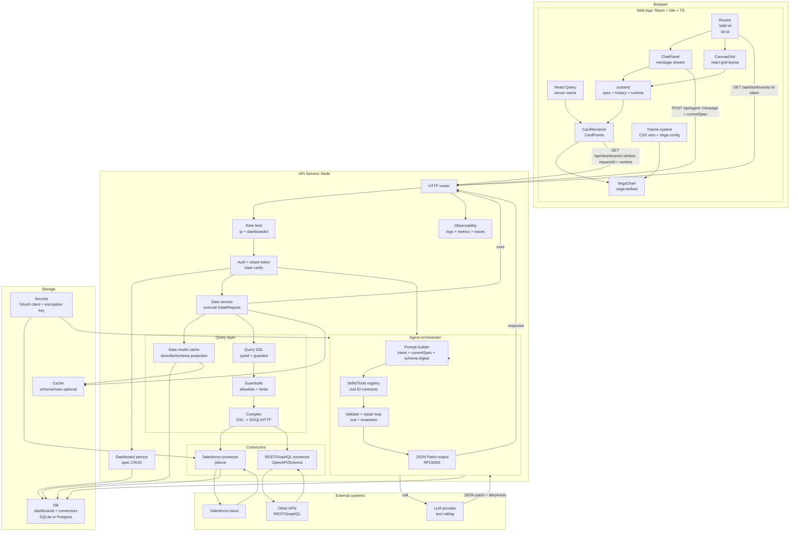

# NL2Dashboard Plan (React/Vite + Vega-Lite + Salesforce/jsforce)

## Summary
Frontend uses React + Vite + TypeScript to build a "chat-driven generation + live canvas" dashboard editor and shareable read-only viewer. Layout uses react-grid-layout; charts render via vega-embed with Vega-Lite specs. Backend uses Node to unify: LLM orchestration, dashboard/spec storage, and data connectors (Salesforce via jsforce), executing a guarded Query DSL and returning only rows for the frontend to render.

## Frontend Stack (Locked)
- Framework/build: React + Vite + TypeScript
- Routing: react-router-dom
- Layout/grid: react-grid-layout (Responsive, draggable/resizable)
- Charts: vega + vega-lite + vega-embed
- Server state: @tanstack/react-query
- Client state: zustand (spec/history/runtime)
- Patch: JSON Patch (RFC6902) via fast-json-patch
- Forms/validation: react-hook-form + zod
- UI primitives: @radix-ui/react-*
- Styling: CSS Variables theme tokens + CSS Modules
- Testing: vitest + @testing-library/react

## Core Contracts
### Persisted
- DashboardSpec
  - title, themeId
  - layout: [{ cardId, x, y, w, h }]
  - cards: ChartCard | TextCard | FilterCard(optional)
  - dataRequests: { [requestId]: DataRequest }

### Runtime (non-persisted by default)
- RuntimeState
  - globalTimeRange
  - filters

### Agent -> UI
- API returns `{ patch: JSONPatch[], dirtyAreas }`
- UI applies patch, refreshes only affected requests/charts

### Data Fetch
- UI calls `GET /api/dashboards/:id/data?requestId=...` with runtime overlay
- Backend executes connector (e.g., Salesforce/jsforce) using guarded Query DSL
- Response `{ rows }` only; no credentials in browser

## Pages
- /edit/:dashboardId
  - Chat panel (natural language)
  - Canvas grid (drag/resize writes back layout)
  - Cards render via Vega-Embed
- /d/:dashboardId
  - Share read-only view
  - Loads spec + fetches rows and renders

## Architecture
Mermaid source: `docs/architecture.mmd`

